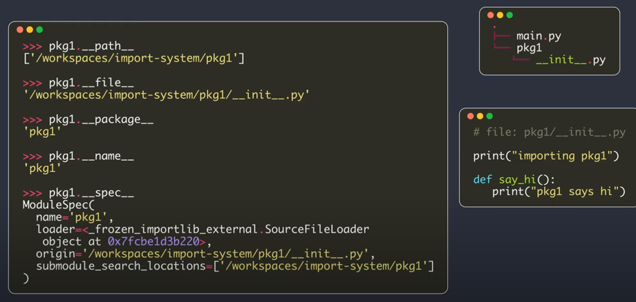

## Initialize

good simple setup video: https://www.youtube.com/watch?v=aTaytcxy2Ck

Documentation: https://airflow.apache.org/docs/apache-airflow/stable/howto/docker-compose/index.html

Docker Compose vs other orchestration: https://stackoverflow.com/questions/64629559/how-to-deploy-a-docker-app-to-production-without-using-docker-compose

```
1. get docker-compose file:
 
curl -LfO 'https://airflow.apache.org/docs/apache-airflow/2.8.0/docker-compose.yaml'

2. Make Dockerfile and add pip dependencies

3. create dags, logs, config, plugins folders

mkdir ./dags ./logs ./config ./plugins

4. Check docker-compose file and make sure that 

change 8080:8080 to, for example(if there is another service running on 8080:

ports:
  - "8081:8080"

5. Make sure that user permission match in the volumes

echo -e "AIRFLOW_UID=$(id -u)\nAIRFLOW_GID=0" > .env

6. Change the source image to your docker file in docker-compose file
  image: .
  build: airflow-custom #custom image name 

7. rebuild image
docker compose build --no-cache

8. initialize
docker-compose up airflow-init

9. run
docker-compose up

```

## Interact

```

1. Run services
docker-compose up -d   # -d is for detached mode

2. Check if running
docker ps

3. exec into environment - get container id from 2. above
docker exec -it <container id of webserver> bash

4. shut down

docker-compose down
OR
docker-compose down --volumes --remove-orphans

5. remove old images from system
docker system prune


```
interact cont.
```


```

## prod deployment resources:

https://garystafford.medium.com/building-a-data-lake-with-apache-airflow-b48bd953c2b

https://www.theserverside.com/blog/Coffee-Talk-Java-News-Stories-and-Opinions/Dockerfile-vs-docker-compose-Whats-the-difference

## connect to instance

https://docs.aws.amazon.com/AWSEC2/latest/UserGuide/connect-linux-inst-ssh.html

```
ssh -i /path/key-pair-name.pem instance-user-name@instance-public-dns-name

```

## git
```
adding new files and directories to .gitignore
then run:
git rm -r --cached .
```

## python



```
# check what modules are imported
sys.modules.items()


```


